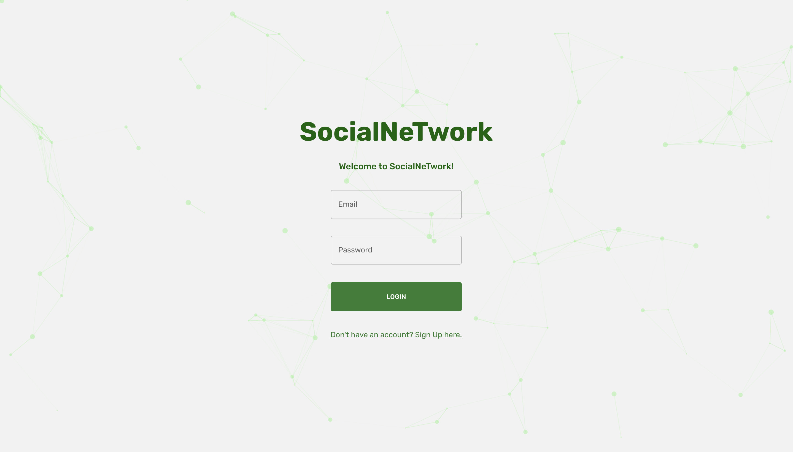

# SocialNetwork

Welcome to SocialNetwork, a full-featured social media platform developed with MERN stack (MongoDB, Express.js, React.js, Node.js). This platform is designed to provide a rich social networking experience, incorporating a broad spectrum of features including user registration, authentication, post creation, and interactions.

## Key Features

- **User Registration & Authentication**: Sign up with your email and password, then log in securely to access your account.

- **Post Creation & Interaction**: Share your thoughts and engage with your network. You can post text, images, and more. You also have the ability to like, comment on, and share posts.

- **Add Friend**: Enhance your network by connecting with other users. You'll be able to see their posts in your feed and interact with them.

- **Search User**: Find other users in an instant with user search feature. You can search by username, name, or email.

- **News Feed**: Stay updated with the latest happenings in your network. The news feed shows posts from your friends.

- **Integrated Ads**: Seamlessly integrated advertisements into the user experience.

- **Friend List Widget**: Check out your friends list using our dedicated widget.

- **Dark Mode**: Personalize your browsing experience with the integrated dark mode feature. Switch to a theme that's easier on the eyes with a simple toggle.

## Getting Started

To get started with SocialNetwork, follow these steps:

1. Clone the repository to your local machine:
git clone https://github.com/akshit0211/SocialNetwork.git

2. Navigate into the project directory:
cd socialnetwork/client

3. Install the required dependencies:
npm install

4. Run the project:
npm run start

Now, navigate to `localhost:3000` in your browser to see the project running.

